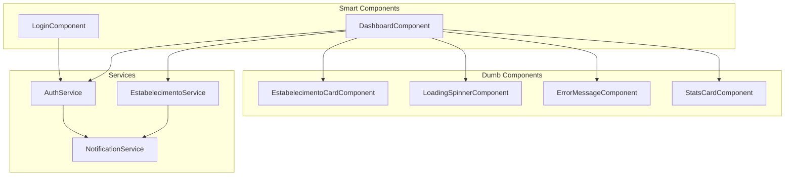
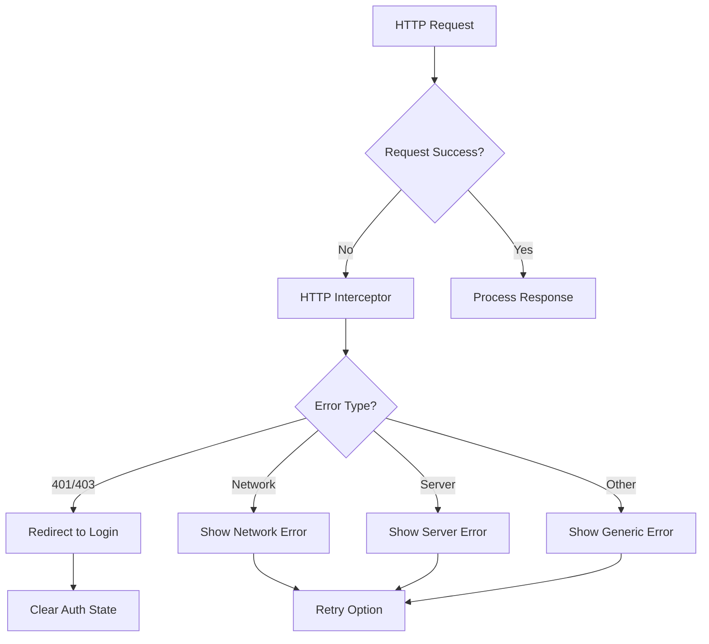

# Design Document

## Overview

Este documento detalha o design de um sistema frontend Angular moderno para autenticação JWT com seleção de estabelecimentos. O sistema consome APIs REST existentes e fornece uma interface elegante e responsiva para proprietários gerenciarem seus estabelecimentos. A arquitetura segue as melhores práticas do Angular com separação clara de responsabilidades, gerenciamento reativo de estado e design system consistente.

## Architecture

### High-Level Architecture

```mermaid
graph TB
    subgraph "Frontend Angular"
        A[Login Component] --> B[Auth Service]
        B --> C[HTTP Interceptor]
        C --> D[Auth API]
        
        E[Dashboard Component] --> F[Estabelecimento Service]
        F --> G[Estabelecimento API]
        
        B --> H[Auth Guard]
        H --> E
        
        I[Token Interceptor] --> C
        J[Error Interceptor] --> C
    end
    
    subgraph "Backend APIs"
        D --> K[/api/Auth/login]
        D --> L[/api/Auth/refresh-token]
        G --> M[/api/Estabelecimento/proprietario/{id}]
    end
    
    subgraph "Storage"
        B --> N[LocalStorage]
        F --> N
    end
```

### Component Architecture



## Components and Interfaces

### 1. Authentication Components

#### LoginComponent (Smart Component)
- **Responsabilidade**: Gerenciar formulário de login e estado de autenticação
- **Inputs**: Nenhum
- **Outputs**: Navegação para dashboard após login bem-sucedido
- **Estado**: 
  - `loginForm: FormGroup`
  - `isLoading: boolean`
  - `errorMessage: string | null`

#### AuthService (Service)
- **Responsabilidade**: Gerenciar estado de autenticação e tokens
- **Métodos principais**:
  - `login(credentials: LoginRequest): Observable<LoginResponse>`
  - `refreshToken(): Observable<LoginResponse>`
  - `logout(): void`
  - `isAuthenticated(): boolean`
  - `getUserId(): string | null`
  - `isProprietario(): boolean`

### 2. Dashboard Components

#### DashboardComponent (Smart Component)
- **Responsabilidade**: Orquestrar dashboard e seleção de estabelecimentos
- **Estado**:
  - `estabelecimentos: Estabelecimento[]`
  - `selectedEstabelecimento: Estabelecimento | null`
  - `isLoadingEstabelecimentos: boolean`
  - `dashboardStats: DashboardStats`

#### EstabelecimentoCardComponent (Dumb Component)
- **Responsabilidade**: Exibir informações de um estabelecimento
- **Inputs**:
  - `estabelecimento: Estabelecimento`
  - `isSelected: boolean`
  - `isLoading: boolean`
- **Outputs**:
  - `select: EventEmitter<Estabelecimento>`
  - `viewDetails: EventEmitter<Estabelecimento>`

#### EstabelecimentoSelectorComponent (Dumb Component)
- **Responsabilidade**: Interface para seleção de estabelecimentos
- **Inputs**:
  - `estabelecimentos: Estabelecimento[]`
  - `selectedEstabelecimento: Estabelecimento | null`
  - `isLoading: boolean`
- **Outputs**:
  - `estabelecimentoSelected: EventEmitter<Estabelecimento>`

### 3. Shared Components

#### LoadingSpinnerComponent (Dumb Component)
- **Responsabilidade**: Exibir indicador de carregamento elegante
- **Inputs**:
  - `size: 'small' | 'medium' | 'large'`
  - `message?: string`

#### ErrorMessageComponent (Dumb Component)
- **Responsabilidade**: Exibir mensagens de erro consistentes
- **Inputs**:
  - `message: string`
  - `type: 'error' | 'warning' | 'info'`
  - `showRetry: boolean`
- **Outputs**:
  - `retry: EventEmitter<void>`

## Data Models

### Enhanced Auth Models
```typescript
// Extending existing models
export interface LoginRequest {
  username: string;
  password: string;
}

export interface RefreshTokenRequest {
  token: string;
  refreshToken: string;
}

export interface UserInfo {
  id: string;
  userName: string;
  email: string;
  nomeUsuario: string;
}

export interface LoginResponse {
  token: string;
  refreshToken: string;
  expiresAt: string;
  roles: string[];
  user: UserInfo;
}

export interface AuthState {
  token: string | null;
  refreshToken: string | null;
  expiresAt: string | null;
  roles: string[];
  user: UserInfo | null;
  isLoading: boolean;
}
```

### Dashboard Models
```typescript
export interface DashboardStats {
  totalPedidos: number;
  faturamento: number;
  clientesAtivos: number;
  avaliacaoMedia: number;
}

export interface EstabelecimentoSelection {
  estabelecimento: Estabelecimento;
  selectedAt: Date;
  stats?: DashboardStats;
}
```

### UI State Models
```typescript
export interface LoadingState {
  isLoading: boolean;
  message?: string;
}

export interface ErrorState {
  hasError: boolean;
  message?: string;
  code?: string;
}

export interface NotificationState {
  type: 'success' | 'error' | 'warning' | 'info';
  message: string;
  duration?: number;
}
```

## Error Handling

### Error Handling Strategy

1. **HTTP Interceptor**: Captura erros globalmente
2. **Service Level**: Trata erros específicos de domínio
3. **Component Level**: Exibe feedback visual ao usuário
4. **Global Error Handler**: Logs e notificações centralizadas

### Error Types and Responses

```typescript
export interface ApiError {
  code: string;
  message: string;
  details?: any;
  timestamp: Date;
}

export enum ErrorCodes {
  UNAUTHORIZED = 'UNAUTHORIZED',
  TOKEN_EXPIRED = 'TOKEN_EXPIRED',
  NETWORK_ERROR = 'NETWORK_ERROR',
  VALIDATION_ERROR = 'VALIDATION_ERROR',
  SERVER_ERROR = 'SERVER_ERROR'
}
```

### Error Handling Flow



## Testing Strategy

### Unit Testing
- **Services**: Testar lógica de negócio e integração com APIs
- **Components**: Testar comportamento e interações
- **Guards**: Testar lógica de autorização
- **Interceptors**: Testar manipulação de requests/responses

### Integration Testing
- **Authentication Flow**: Login → Dashboard → Estabelecimento Selection
- **Error Scenarios**: Network failures, token expiration, API errors
- **Responsive Behavior**: Mobile and desktop layouts

### E2E Testing
- **Happy Path**: Login completo até seleção de estabelecimento
- **Error Paths**: Login inválido, sem estabelecimentos, erros de rede
- **Accessibility**: Navegação por teclado, screen readers

## UI/UX Design System

### Design Tokens
```scss
// Colors
$primary-color: #2563eb;
$secondary-color: #64748b;
$success-color: #10b981;
$error-color: #ef4444;
$warning-color: #f59e0b;

// Typography
$font-family-primary: 'Inter', sans-serif;
$font-size-xs: 0.75rem;
$font-size-sm: 0.875rem;
$font-size-base: 1rem;
$font-size-lg: 1.125rem;
$font-size-xl: 1.25rem;

// Spacing
$spacing-xs: 0.25rem;
$spacing-sm: 0.5rem;
$spacing-md: 1rem;
$spacing-lg: 1.5rem;
$spacing-xl: 2rem;

// Breakpoints
$breakpoint-sm: 640px;
$breakpoint-md: 768px;
$breakpoint-lg: 1024px;
$breakpoint-xl: 1280px;
```

### Component Styling Strategy
- **BEM Methodology**: Block, Element, Modifier naming
- **SCSS Modules**: Scoped styles per component
- **Responsive Design**: Mobile-first approach
- **Accessibility**: WCAG 2.1 AA compliance

### Animation and Transitions
```scss
// Transition tokens
$transition-fast: 150ms ease-in-out;
$transition-normal: 250ms ease-in-out;
$transition-slow: 350ms ease-in-out;

// Animation presets
@keyframes fadeIn {
  from { opacity: 0; transform: translateY(10px); }
  to { opacity: 1; transform: translateY(0); }
}

@keyframes slideIn {
  from { transform: translateX(-100%); }
  to { transform: translateX(0); }
}
```

## API Configuration and Management

### API Endpoint Configuration

O sistema deve ser configurado para consumir APIs de forma flexível, permitindo mudanças de endpoints sem necessidade de rebuild da aplicação.

#### Environment Configuration
```typescript
// environments/environment.ts
export const environment = {
  production: false,
  apiBaseUrl: 'http://localhost:5283',
  swaggerUrl: 'http://localhost:5283/swagger/v1/swagger.json',
  endpoints: {
    auth: {
      login: '/api/Auth/login',
      refreshToken: '/api/Auth/refresh-token'
    },
    estabelecimento: {
      byProprietario: '/api/Estabelecimento/proprietario/{userId}',
      byId: '/api/Estabelecimento/{id}'
    }
  }
};
```

#### API Service Pattern
```typescript
@Injectable({ providedIn: 'root' })
export class ApiConfigService {
  private config = environment;
  
  getEndpoint(path: string, params?: Record<string, string>): string {
    let endpoint = this.config.apiBaseUrl + path;
    
    if (params) {
      Object.entries(params).forEach(([key, value]) => {
        endpoint = endpoint.replace(`{${key}}`, value);
      });
    }
    
    return endpoint;
  }
  
  // Método para atualizar configuração dinamicamente
  updateApiConfig(newConfig: Partial<typeof environment>): void {
    this.config = { ...this.config, ...newConfig };
  }
}
```

#### Swagger Integration
- **Documentation Reference**: `http://localhost:5283/swagger/v1/swagger.json`
- **Type Generation**: Considerar uso de ferramentas como `swagger-codegen` para gerar tipos TypeScript
- **API Validation**: Validar contratos de API durante desenvolvimento

#### API Versioning Strategy
```typescript
export interface ApiVersion {
  version: string;
  endpoints: Record<string, string>;
  deprecated?: boolean;
  migrationGuide?: string;
}

@Injectable({ providedIn: 'root' })
export class ApiVersionService {
  private currentVersion = 'v1';
  
  getVersionedEndpoint(endpoint: string): string {
    return `/api/${this.currentVersion}${endpoint}`;
  }
}
```

## Security Considerations

### Token Management
- **JWT Storage**: LocalStorage com fallback para SessionStorage
- **Token Refresh**: Automático antes da expiração
- **Logout**: Limpeza completa de dados sensíveis

### API Security
- **Authorization Headers**: Bearer token em todas as requisições autenticadas
- **HTTPS Only**: Todas as comunicações via HTTPS
- **CORS**: Configuração adequada no backend

### XSS Protection
- **Sanitização**: Angular DomSanitizer para conteúdo dinâmico
- **CSP Headers**: Content Security Policy
- **Input Validation**: Validação client-side e server-side

## Performance Optimization

### Loading Strategies
- **Lazy Loading**: Módulos carregados sob demanda
- **OnPush Strategy**: Change detection otimizada
- **TrackBy Functions**: Otimização de listas
- **Skeleton Loading**: Feedback visual durante carregamento

### Caching Strategy
- **HTTP Caching**: Cache de estabelecimentos por sessão
- **Service Worker**: Cache offline para recursos estáticos
- **Memory Management**: Unsubscribe de observables

### Bundle Optimization
- **Tree Shaking**: Remoção de código não utilizado
- **Code Splitting**: Divisão em chunks menores
- **Compression**: Gzip/Brotli compression

## Accessibility

### WCAG 2.1 AA Compliance
- **Keyboard Navigation**: Navegação completa por teclado
- **Screen Reader Support**: ARIA labels e roles
- **Color Contrast**: Mínimo 4.5:1 para texto normal
- **Focus Management**: Indicadores visuais claros

### Semantic HTML
- **Proper Headings**: Hierarquia h1-h6 correta
- **Form Labels**: Labels associados aos inputs
- **Button Roles**: Buttons vs links apropriados
- **Landmark Roles**: Navigation, main, aside, footer