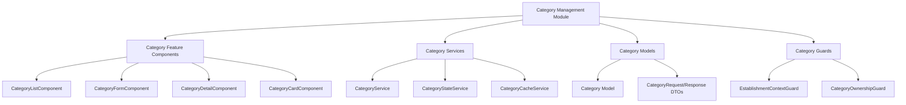

# Design Document - Sistema de Gerenciamento de Categorias

## Overview

O sistema de gerenciamento de categorias é um módulo completo que permite aos proprietários de estabelecimentos criar, visualizar, editar e excluir categorias de produtos/serviços. O sistema segue os princípios de isolamento por estabelecimento, segurança robusta e experiência de usuário otimizada.

## Architecture

### High-Level Architecture



### Module Structure

```
src/app/features/categories/
├── components/
│   ├── category-list/
│   ├── category-form/
│   ├── category-detail/
│   └── category-card/
├── services/
│   ├── category.service.ts
│   ├── category-state.service.ts
│   └── category-cache.service.ts
├── models/
│   ├── category.models.ts
│   └── category-dto.models.ts
├── guards/
│   └── category-ownership.guard.ts
├── pages/
│   ├── category-list-page/
│   ├── category-create-page/
│   └── category-edit-page/
└── categories.routes.ts
```

## Components and Interfaces

### Core Models

```typescript
// Category Model
export interface Category {
  id: number;
  nome: string;
  descricao: string;
  estabelecimentoId: number;
  ativo: boolean;
  dataCriacao: Date;
  dataAtualizacao: Date;
  produtosCount?: number; // Para validar exclusão
}

// Category Request DTOs
export interface CreateCategoryRequest {
  nome: string;
  descricao: string;
}

export interface UpdateCategoryRequest {
  nome: string;
  descricao: string;
  ativo: boolean;
}

// Category Response DTOs
export interface CategoryListResponse {
  categorias: Category[];
  total: number;
  pagina: number;
  totalPaginas: number;
}

export interface CategoryDetailResponse {
  categoria: Category;
  produtos: ProductSummary[];
}
```

### Service Interfaces

```typescript
// Category Service Interface
export interface ICategoryService {
  // CRUD Operations
  getCategories(estabelecimentoId: number, page?: number, limit?: number): Observable<CategoryListResponse>;
  getCategoryById(estabelecimentoId: number, categoryId: number): Observable<Category>;
  createCategory(estabelecimentoId: number, request: CreateCategoryRequest): Observable<Category>;
  updateCategory(estabelecimentoId: number, categoryId: number, request: UpdateCategoryRequest): Observable<Category>;
  deleteCategory(estabelecimentoId: number, categoryId: number): Observable<void>;
  
  // Utility Methods
  searchCategories(estabelecimentoId: number, query: string): Observable<Category[]>;
  validateCategoryName(estabelecimentoId: number, nome: string, excludeId?: number): Observable<boolean>;
}

// Category State Service Interface
export interface ICategoryStateService {
  // State Management
  categories$: Observable<Category[]>;
  selectedCategory$: Observable<Category | null>;
  loading$: Observable<boolean>;
  error$: Observable<string | null>;
  
  // State Actions
  loadCategories(estabelecimentoId: number): void;
  selectCategory(category: Category): void;
  addCategory(category: Category): void;
  updateCategory(category: Category): void;
  removeCategory(categoryId: number): void;
  clearState(): void;
}
```

### Component Architecture

#### CategoryListComponent
```typescript
@Component({
  selector: 'app-category-list',
  standalone: true,
  changeDetection: ChangeDetectionStrategy.OnPush
})
export class CategoryListComponent implements OnInit, OnDestroy {
  // Properties
  categories$ = this.categoryState.categories$;
  loading$ = this.categoryState.loading$;
  error$ = this.categoryState.error$;
  selectedEstablishment$ = this.establishmentService.selectedEstabelecimento$;
  
  // Methods
  onCreateCategory(): void;
  onEditCategory(category: Category): void;
  onDeleteCategory(category: Category): void;
  onSearchCategories(query: string): void;
  trackByCategory(index: number, category: Category): number;
}
```

#### CategoryFormComponent
```typescript
@Component({
  selector: 'app-category-form',
  standalone: true,
  changeDetection: ChangeDetectionStrategy.OnPush
})
export class CategoryFormComponent implements OnInit {
  // Form Properties
  categoryForm: FormGroup;
  isEditMode = signal(false);
  loading = signal(false);
  
  // Validation
  nameAsyncValidator = (control: AbstractControl) => 
    this.categoryService.validateCategoryName(this.establishmentId, control.value, this.categoryId);
  
  // Methods
  onSubmit(): void;
  onCancel(): void;
  private buildForm(): void;
  private handleSubmitSuccess(category: Category): void;
  private handleSubmitError(error: any): void;
}
```

## Data Models

### API Integration Models

```typescript
// API Endpoints Configuration
export const CATEGORY_ENDPOINTS = {
  LIST: '/api/categorias/estabelecimentos/{estabelecimentoId}/categorias',
  DETAIL: '/api/categorias/estabelecimentos/{estabelecimentoId}/categorias/{id}',
  CREATE: '/api/categorias/estabelecimentos/{estabelecimentoId}/categorias',
  UPDATE: '/api/categorias/estabelecimentos/{estabelecimentoId}/categorias/{id}',
  DELETE: '/api/categorias/estabelecimentos/{estabelecimentoId}/categorias/{id}'
} as const;

// HTTP Client Service
export class CategoryHttpService {
  constructor(private http: HttpClient) {}
  
  getCategories(estabelecimentoId: number, params?: CategoryListParams): Observable<CategoryListResponse> {
    const url = CATEGORY_ENDPOINTS.LIST.replace('{estabelecimentoId}', estabelecimentoId.toString());
    return this.http.get<CategoryListResponse>(url, { params });
  }
  
  getCategoryById(estabelecimentoId: number, categoryId: number): Observable<Category> {
    const url = CATEGORY_ENDPOINTS.DETAIL
      .replace('{estabelecimentoId}', estabelecimentoId.toString())
      .replace('{id}', categoryId.toString());
    return this.http.get<Category>(url);
  }
  
  // ... other CRUD methods
}
```

### State Management Models

```typescript
// Category State Interface
export interface CategoryState {
  categories: Category[];
  selectedCategory: Category | null;
  loading: boolean;
  error: string | null;
  filters: CategoryFilters;
  pagination: PaginationState;
}

// Category Filters
export interface CategoryFilters {
  search: string;
  ativo: boolean | null;
  sortBy: 'nome' | 'dataCriacao' | 'dataAtualizacao';
  sortOrder: 'asc' | 'desc';
}

// Pagination State
export interface PaginationState {
  currentPage: number;
  pageSize: number;
  totalItems: number;
  totalPages: number;
}
```

## Error Handling

### Error Types and Handling Strategy

```typescript
// Custom Error Types
export class CategoryError extends Error {
  constructor(
    message: string,
    public code: string,
    public statusCode?: number
  ) {
    super(message);
    this.name = 'CategoryError';
  }
}

export class CategoryNotFoundError extends CategoryError {
  constructor(categoryId: number) {
    super(`Categoria com ID ${categoryId} não encontrada`, 'CATEGORY_NOT_FOUND', 404);
  }
}

export class CategoryAccessDeniedError extends CategoryError {
  constructor() {
    super('Acesso negado à categoria', 'CATEGORY_ACCESS_DENIED', 403);
  }
}

export class CategoryValidationError extends CategoryError {
  constructor(field: string, message: string) {
    super(`Erro de validação no campo ${field}: ${message}`, 'CATEGORY_VALIDATION_ERROR', 400);
  }
}

// Error Handler Service
@Injectable()
export class CategoryErrorHandler {
  handleError(error: any): Observable<never> {
    let categoryError: CategoryError;
    
    switch (error.status) {
      case 404:
        categoryError = new CategoryNotFoundError(error.categoryId);
        break;
      case 403:
        categoryError = new CategoryAccessDeniedError();
        break;
      case 400:
        categoryError = new CategoryValidationError(error.field, error.message);
        break;
      default:
        categoryError = new CategoryError('Erro interno do servidor', 'INTERNAL_ERROR', 500);
    }
    
    return throwError(() => categoryError);
  }
}
```

## Testing Strategy

### Unit Testing Approach

```typescript
// Category Service Tests
describe('CategoryService', () => {
  let service: CategoryService;
  let httpMock: HttpTestingController;
  
  beforeEach(() => {
    TestBed.configureTestingModule({
      imports: [HttpClientTestingModule],
      providers: [CategoryService]
    });
  });
  
  it('should create category with correct establishment context', () => {
    const estabelecimentoId = 1;
    const request: CreateCategoryRequest = {
      nome: 'Bebidas',
      descricao: 'Categoria de bebidas'
    };
    
    service.createCategory(estabelecimentoId, request).subscribe();
    
    const req = httpMock.expectOne(
      `/api/categorias/estabelecimentos/${estabelecimentoId}/categorias`
    );
    expect(req.request.method).toBe('POST');
    expect(req.request.body).toEqual(request);
  });
});

// Component Integration Tests
describe('CategoryListComponent', () => {
  let component: CategoryListComponent;
  let fixture: ComponentFixture<CategoryListComponent>;
  let categoryService: jasmine.SpyObj<CategoryService>;
  
  beforeEach(() => {
    const spy = jasmine.createSpyObj('CategoryService', ['getCategories', 'deleteCategory']);
    
    TestBed.configureTestingModule({
      imports: [CategoryListComponent],
      providers: [
        { provide: CategoryService, useValue: spy }
      ]
    });
    
    categoryService = TestBed.inject(CategoryService) as jasmine.SpyObj<CategoryService>;
  });
  
  it('should load categories for selected establishment', () => {
    const estabelecimentoId = 1;
    const mockCategories = [
      { id: 1, nome: 'Bebidas', descricao: 'Categoria de bebidas', estabelecimentoId }
    ];
    
    categoryService.getCategories.and.returnValue(of({ categorias: mockCategories, total: 1 }));
    
    component.ngOnInit();
    
    expect(categoryService.getCategories).toHaveBeenCalledWith(estabelecimentoId);
  });
});
```

### E2E Testing Scenarios

```typescript
// E2E Test Scenarios
describe('Category Management E2E', () => {
  it('should complete full CRUD cycle', () => {
    // 1. Navigate to categories
    cy.visit('/categories');
    
    // 2. Create new category
    cy.get('[data-cy=create-category-btn]').click();
    cy.get('[data-cy=category-name-input]').type('Bebidas');
    cy.get('[data-cy=category-description-input]').type('Categoria de bebidas');
    cy.get('[data-cy=submit-btn]').click();
    
    // 3. Verify creation
    cy.get('[data-cy=category-list]').should('contain', 'Bebidas');
    
    // 4. Edit category
    cy.get('[data-cy=edit-category-btn]').first().click();
    cy.get('[data-cy=category-name-input]').clear().type('Bebidas e Sucos');
    cy.get('[data-cy=submit-btn]').click();
    
    // 5. Verify update
    cy.get('[data-cy=category-list]').should('contain', 'Bebidas e Sucos');
    
    // 6. Delete category
    cy.get('[data-cy=delete-category-btn]').first().click();
    cy.get('[data-cy=confirm-delete-btn]').click();
    
    // 7. Verify deletion
    cy.get('[data-cy=category-list]').should('not.contain', 'Bebidas e Sucos');
  });
  
  it('should enforce establishment isolation', () => {
    // Test that categories from different establishments are not visible
    cy.login('proprietario1@test.com');
    cy.selectEstablishment('Estabelecimento 1');
    cy.visit('/categories');
    cy.get('[data-cy=category-list]').should('not.contain', 'Categoria do Estabelecimento 2');
  });
});
```

## Security Considerations

### Authentication and Authorization

```typescript
// Category Ownership Guard
@Injectable()
export class CategoryOwnershipGuard implements CanActivate {
  constructor(
    private authService: AuthService,
    private establishmentService: EstablishmentService,
    private categoryService: CategoryService
  ) {}
  
  canActivate(route: ActivatedRouteSnapshot): Observable<boolean> {
    const categoryId = +route.params['id'];
    const establishmentId = this.establishmentService.getSelectedEstablishmentId();
    
    if (!establishmentId) {
      return of(false);
    }
    
    return this.categoryService.getCategoryById(establishmentId, categoryId).pipe(
      map(category => category.estabelecimentoId === establishmentId),
      catchError(() => of(false))
    );
  }
}

// API Security Interceptor
@Injectable()
export class CategorySecurityInterceptor implements HttpInterceptor {
  intercept(req: HttpRequest<any>, next: HttpHandler): Observable<HttpEvent<any>> {
    // Validate establishment context in category requests
    if (req.url.includes('/api/categorias/estabelecimentos/')) {
      const establishmentId = this.extractEstablishmentId(req.url);
      
      if (!this.validateEstablishmentAccess(establishmentId)) {
        return throwError(() => new CategoryAccessDeniedError());
      }
    }
    
    return next.handle(req);
  }
}
```

### Data Validation and Sanitization

```typescript
// Input Sanitization Service
@Injectable()
export class CategorySanitizationService {
  sanitizeCategoryInput(input: CreateCategoryRequest | UpdateCategoryRequest): typeof input {
    return {
      ...input,
      nome: this.sanitizeString(input.nome),
      descricao: this.sanitizeString(input.descricao)
    };
  }
  
  private sanitizeString(input: string): string {
    return input
      .trim()
      .replace(/<script\b[^<]*(?:(?!<\/script>)<[^<]*)*<\/script>/gi, '') // Remove scripts
      .replace(/[<>]/g, '') // Remove HTML tags
      .substring(0, 500); // Limit length
  }
}
```

## Performance Optimization

### Caching Strategy

```typescript
// Category Cache Service
@Injectable()
export class CategoryCacheService {
  private cache = new Map<string, { data: any; timestamp: number; ttl: number }>();
  private readonly DEFAULT_TTL = 5 * 60 * 1000; // 5 minutes
  
  get<T>(key: string): T | null {
    const cached = this.cache.get(key);
    
    if (!cached) return null;
    
    if (Date.now() - cached.timestamp > cached.ttl) {
      this.cache.delete(key);
      return null;
    }
    
    return cached.data;
  }
  
  set<T>(key: string, data: T, ttl = this.DEFAULT_TTL): void {
    this.cache.set(key, {
      data,
      timestamp: Date.now(),
      ttl
    });
  }
  
  invalidateEstablishmentCache(establishmentId: number): void {
    const keysToDelete = Array.from(this.cache.keys())
      .filter(key => key.includes(`establishment-${establishmentId}`));
    
    keysToDelete.forEach(key => this.cache.delete(key));
  }
}
```

### Optimistic Updates

```typescript
// Optimistic Update Strategy
export class CategoryOptimisticService {
  updateCategoryOptimistically(
    category: Category,
    update: UpdateCategoryRequest,
    updateFn: () => Observable<Category>
  ): Observable<Category> {
    // Apply optimistic update
    const optimisticCategory = { ...category, ...update };
    this.categoryState.updateCategory(optimisticCategory);
    
    return updateFn().pipe(
      tap(updatedCategory => {
        // Replace with server response
        this.categoryState.updateCategory(updatedCategory);
      }),
      catchError(error => {
        // Revert optimistic update
        this.categoryState.updateCategory(category);
        return throwError(() => error);
      })
    );
  }
}
```

## Accessibility Features

### ARIA Implementation

```typescript
// Accessibility Service
@Injectable()
export class CategoryAccessibilityService {
  announceAction(action: string, categoryName: string): void {
    const message = this.getActionMessage(action, categoryName);
    this.liveAnnouncer.announce(message);
  }
  
  private getActionMessage(action: string, categoryName: string): string {
    const messages = {
      created: `Categoria ${categoryName} criada com sucesso`,
      updated: `Categoria ${categoryName} atualizada com sucesso`,
      deleted: `Categoria ${categoryName} excluída com sucesso`,
      error: `Erro ao processar categoria ${categoryName}`
    };
    
    return messages[action] || `Ação ${action} realizada para categoria ${categoryName}`;
  }
}
```

## Conclusion

O design do sistema de gerenciamento de categorias segue as melhores práticas de arquitetura Angular, com foco em:

1. **Isolamento por Estabelecimento**: Garantia de que cada proprietário vê apenas suas categorias
2. **Segurança Robusta**: Guards, interceptors e validações em múltiplas camadas
3. **Performance Otimizada**: Cache inteligente, optimistic updates e lazy loading
4. **Experiência de Usuário**: Interface responsiva, acessível e com feedback adequado
5. **Testabilidade**: Arquitetura que facilita testes unitários e de integração
6. **Manutenibilidade**: Código modular, tipado e bem documentado

O sistema está preparado para escalar e integrar-se perfeitamente com o ecossistema existente do Rapidex.